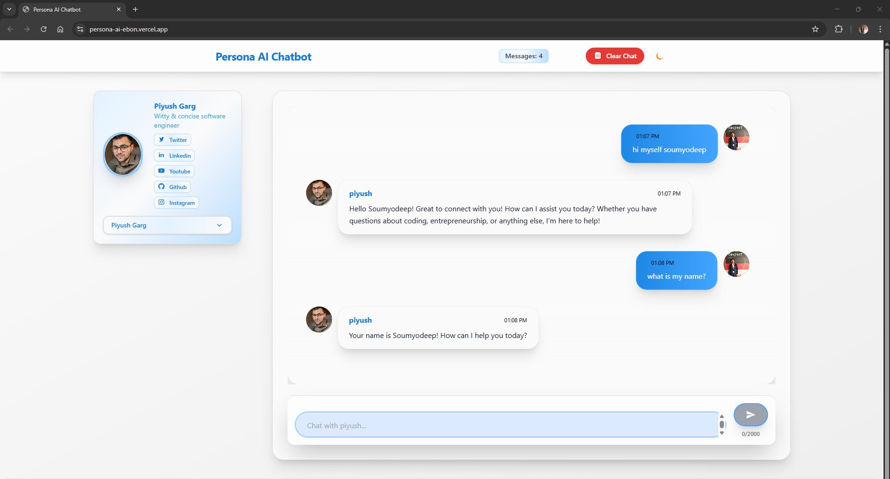
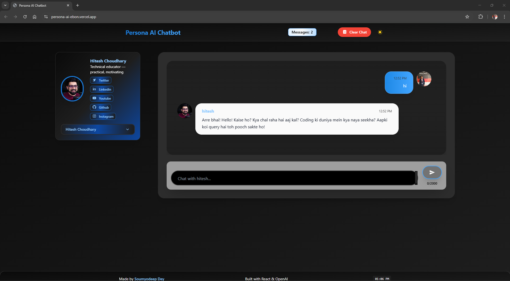

# Persona AI

A web application built with **React + Vite + Tailwind CSS** and **OpenAI API** that mimics the conversational tone of two well-known tech creators — **Hitesh Choudhary** and **Piyush Garg** — based on reference tones from their YouTube and Twitter content.

---

## 🎯 Project Overview
Utilising LLM models, this project builds two distinct personas that respond in the tone, style, and mannerisms of Hitesh Choudhary and Piyush Garg.  
The website allows users to switch between these personas seamlessly and chat with them in real time.

**References:**
- [Hitesh Choudhary](https://hitesh.ai/)
- [Piyush Garg](https://www.piyushgarg.dev/)

---

## 📅 Timeline
- **Start:** 13 Aug 2025, 9:00 pm  
- **Due:** 15 Aug 2025, 3:00 pm  
- **Eval Begins:** 15 Aug 2025, 3:00 pm  
- **Eval Ends:** 15 Aug 2025, 9:00 pm  

---

## ✨ Features
- 🔄 **Persona Switching** – Instantly switch between Hitesh and Piyush modes.
- 💬 **Tone Matching** – AI responses tuned to each creator’s unique style.
- ⚡ **Fast & Responsive** – Powered by Vite and styled with Tailwind CSS.
- 🤖 **OpenAI Integration** – Context-aware, dynamic replies.
- 📜 **Sample Data & Prompts** – Includes examples to fine-tune persona accuracy.

---

## 🛠 Tech Stack
- **Frontend:** React, Vite, Tailwind CSS
- **AI:** OpenAI Chat Completions API
- **Build Tools:** PostCSS, ESLint
- **Deployment:** Vercel / Netlify (optional)

---

## 📸 Screenshots





---

## 📂 Project Structure
```
eslint.config.js        # Linting rules
index.html              # Base HTML
package.json            # Dependencies & scripts
postcss.config.js       # PostCSS setup for Tailwind
README.md               # Documentation
tailwind.config.js      # Tailwind configuration
vite.config.js          # Vite build configuration
public/
  personaData.json      # Sample tone/style reference data
src/
  App.jsx               # Main app UI
  main.jsx              # React entry point
  index.css             # Tailwind imports + global CSS
  api/openai.js         # OpenAI API helper functions
  assets/               # Images and icons
```

---

## 🚀 Getting Started

### 1. Clone the Repository
```bash
git clone https://github.com/yourusername/persona-ai.git
cd persona-ai
```

### 2. Install Dependencies
```bash
npm install
```

### 3. Environment Variables
Create a `.env` file in the project root:
```env
VITE_OPENAI_API_KEY=your_openai_api_key_here
```

### 4. Run Development Server
```bash
npm run dev
```

### 5. Build for Production
```bash
npm run build
```

---

## 📋 Submission Instructions
As per the hackathon brief:
- Build a website that uses an LLM to mimic Hitesh Choudhary & Piyush Garg’s tone from YouTube/Twitter.
- Show data preparation, prompt logic, and sample chats for both personas.
- Include this README with setup steps.

---

## 🧪 Evaluation Parameters
- **Persona Match:** Accurate tone for each persona.
- **Relevance:** On-topic, context-aware replies.
- **Implementation:** Website design, code quality, LLM integration.
- **UX:** Smooth persona switching, clear responses.

---

## 📜 Prompt Logic
The system prompt changes based on selected persona:

**Hitesh Choudhary Prompt:**
> You are Hitesh Choudhary, a tech educator. Respond in a friendly, Hindi-English mix, motivational yet practical tone.

**Piyush Garg Prompt:**
> You are Piyush Garg, a software engineer and YouTuber. Respond in a witty, casual, but informative style.

Few-shot examples from public posts/videos are included in `personaData.json` to enhance tone matching.


---

## ⚠️ Disclaimer
This project is for educational/demo purposes only.
All personality traits and tones are based on publicly available content and are not official representations of the individuals.